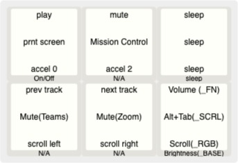

# pizzapad

## What is pizzapad?
pizzapad is a 5 key macropad with encoder and rgb led support inspired by Stellar Pizza's flaming pizza logo!

## How can I build one?
### Create the PCB
The latest gerbers files are included in the "gerber" folder. These can be used to order pcb's from your favorite pcb manufacturer, such as [JLCPCB](https://jlcpcb.com/)

### Buy and Solder parts

To build a pizzapad you'll need

|Part|Quantity|Digikey #|Manufactuer #|
|---|---|---|---|
|Pcb|1|N/A|N/A|
|cherryMX compatible switches|5|N/A|N/A|
|cherryMX compatible hotswap sockets|5|N/A|N/A|
|promicro compatible microcontroller|1|N/A|N/A|
|reset switch|1|B3U-1000P|SW1020CT-ND|
|rotary encoder|1|PEC11R-4215F-S0024|PEC11R-4215F-S0024-ND|
|addressable led|5|4684|1528-4684-ND|
|diode|5|1N4148WX-TP|1N4148WX-TPMSCT-ND|
|10K ohm resistor|2|RMCF0805JT10k0|RMCF0805JT10k0CT-ND|

### install firmware
pizzapad's firmware is based on The [QMK Project](https://github.com/qmk/qmk_firmware)

1) Download the base QMK firmware following the instructions on QMK's github page
2) Create a folder called `pizzapad` in `qmk_firmware/keyboards`
3) Build the firmware according to QMK's build instructions, pointing it to the `pizzapad` keyboard folder.
4) Profit!

#### Default key layout

The default has 4 layers. Switch layers by pressing the encoder in.
##### Layer 1 - Media
This layer focuses on media controls, with the encoder controlling volume

##### Layer 2 - FN
This layer focuses on some hopefully useful shortcuts. The encoder switches between active windows (simulates alt-tab)

##### Layer 3 - Scroll
This layer brings scrolling to the macropad. The encoder controls scrolling vertically, and buttons 4 + 5 control horizontal scrolling

##### Layer 4 - RGB
This layer controls the rgb indicator lights. The encoder turns brightness up and down. This layer isn't fully functional yet, but brightness controls should work.